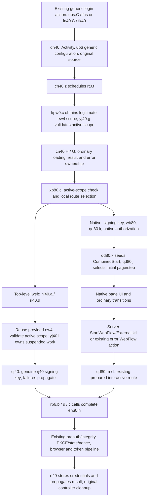

# Top-level browser entry and state — 2026-10-02

This targeted follow-up resolves the controller initialization issue from browser-route-contract.md for a different entry: the existing top-level web pipeline. It identifies a bounded route-selection point; **no browser preference is implemented, no release is published, and no device or login action is performed**. Evidence is the same pinned 1.2026.265 / 2626541 APK and actual DEX instructions, not JADX's unreliable reconstruction of suspended branches.

## Existing call/state chart

The generic UI path is concrete: `ubs.C` constructs `dn40` from the `fas` action with `ub6.e`; `ln40.C` also forwards a generic `fk40` configuration via `dn40`. `cn40.z` schedules `rt0`; `rt0.t` acquires a scope with `kpw0.c`, checks `yj40.g`, and calls `cn40.H` for `dn40`. The default mask 488 retains false for the boolean in question. `cn40.G` delegates to `xb80.c` and interprets its success as the top-level `vm40` result, including `tm40`, rather than a native password `cf6` page. The surrounding loading/error/cleanup owner remains the original controller.

## Initialization clarified

`usk.e` synchronously clears the stack and adds exactly one `ef80(step)`. `qd80.k` resets UI/controller flags, seeds `CombinedStart`, and resets `qd80.q` before the native initial request. `wb80` calls `qd80.k` before the native request. `xb80.c` later calls `qd80.j` with the selected initial step/page; `qd80.j` sets the current page and reseeds the stack. Thus the displayed native page has an initialized step through its ordinary creation path.

`pj7.G` and `pj7.H` are back/navigation operations, not standalone login initialization. The server-transition handler `qd80.h` validates the active scope, preserves the server page/step, updates or resets stack as appropriate, and only uses its existing StartWebFlow/ExternalUrl handling. The error WebFlow action belongs to its own error page. None should be converted into an unconditional fallback.

The top-level `nl40` / `rl40` route avoids the empty-stack issue entirely: it does not call `qd80.l` or require its native page stack. It receives the legitimate `ew4` scope, checks that scope, acquires the same genuine signing-key lease, then enters `ehu0.h` through `rp6`. It owns its ordinary suspension and credential result/storage. No native-page result is synthesized.

## Bounded integration point

At `xb80.c`'s first invocation, after its existing active-scope check, a local expression chooses native eligibility from the authentication configuration, optional existing credential object, and silent-mode boolean. The conditional immediately after constructing the empty fallback-state holder enters either native setup or the normal top-level web setup. It is before a native request or rejection. No integrity result, challenge response, remote error, or feature-gate result supplies this selector.

For a future explicit, default-off patch preference, the bounded point is this **route-selection expression**, scoped to `ec6 == ub6.e`, interactive mode, no existing credential object, `fa6.e` (WelcomeDisclosure), and a fresh scope without a reauthentication binding (`yj40.c == null`). These narrow source/scope guards exclude account-selection, MFA, SSO retrigger, deep-link and other reauthentication contexts; their existing paths must remain intact. It could choose the already existing complete top-level web branch while retaining the original Activity/context, `ew4`, configuration, source, continuation and all downstream checks. Its branch target must be the original web setup block, not the `ehu0`/browser call. Other providers, silent auth, reauthentication and in-progress native pages must retain their original routes. A new on-screen action would need separate UI work; a build-time Morphe preference could reuse the existing generic login action without that work.

Crucially, **do not set the existing boolean to true to select web**. Dataflow from `xb80.c` through `nl40.a`, `rl40.d`, `ql40`, and `sm40.f` reaches `rp6.b`, where true selects `fhu0.b` (silent) and false selects `fhu0.a` (interactive). It is not a pure browser-choice flag. This resolved a plausible but incorrect shortcut.

This is a statically compatible integration design, not an implemented or runtime-proven candidate. A later implementation requires exact class/method fingerprints, first-invocation-only guards, tests for suspension and ordinary caller result ownership, and control-flow/security invariants comparing the untouched full web pipeline. No gate or server rejection is to be converted to success. The existing `ehu0.h` preflight can still reject the cloned app; this investigation does not prove acceptance.

## Remaining observations and limits

No further observation is needed to establish the static top-level entry described above. Before any future claim that it works on the user's device, a separately authorized test would need only fixed categories confirming: generic interactive entry selected, valid scope, full web preflight reached, browser dispatched, callback received/validated by the clone, and ordinary completion or a categorized failure. This must not record credentials, account identity, tokens, state/nonce values, cookie values, auth URLs or server text. The already released diagnostics cover several downstream phases; any new entry/scope categories would require a separately reviewed allowlist extension. No test is requested tonight.

The generic `ub6` configuration has no Google provider; `vb6` separately specifies Google. Hosted email/password availability and acceptance remain runtime facts. The existing Auth Tab redirect configuration is statically verified. The fallback custom-scheme callback still shares its initial Android resolver filter with the original app; returning to the clone requires observation, and no such browser callback was present in the earlier password attempt.

The static differential now includes 98 selected classes, covering the top-level route, scopes, continuations and provider construction in addition to prior native/security classes. With tracing off, 97 are canonically identical and only the intentional redirect configuration correction differs. Both original/patched configurations passed the added structural assertions. `BrowserRouteContract.kt` checks the original and patched instructions for stack reset/seed, valid-scope entry, ordinary web setup, genuine signing-key acquisition and the complete authenticator call. This audits the unchanged baseline; it does not validate an unimplemented route preference. No proprietary binaries, method bodies or raw logs are included.

Validation: all 19 Kotlin tests passed against the pinned APK; the offline Android patch build succeeded; source-only checks passed. Production patch code and release metadata remain identical to dev.7. The earlier 11 Python tests remain passing and were not changed by this follow-up.
